# Batch inference architecture

End-to-end flow: ingest prompts → segment into chunks → scatter across arq workers → throttle with Redis / leases → gather NDJSON results and webhooks.

API accepts work once; workers own the rest. Progressive checkpoints land in Spaces/MinIO per chunk; Postgres tracks `Batch` / `BatchChunk` state; Redis backs arq jobs and the shared token bucket.

> Live diagram: Cursor Canvas `batch-inference-architecture.canvas.tsx` (open beside chat in the IDE).

## System flow

```mermaid
flowchart LR
  subgraph Ingestion["1. Ingestion track"]
    api["POST /v1/batches<br/>JSON · multipart /upload · prompts_url/key"]
    create["create_batch<br/>NDJSON → Spaces prompts_key"]
    batch_row["Batch Postgres<br/>status=pending · enqueue job"]
    api --> create --> batch_row
  end

  subgraph Segmentation["2. Segmentation pipeline"]
    orchestrate["orchestrate_batch<br/>running · plan_chunks chunk_size"]
    chunks["BatchChunk rows<br/>offset / limit per chunk"]
    enqueue["enqueue process_chunk<br/>Redis / arq job queue"]
    orchestrate --> chunks --> enqueue
  end

  subgraph Scatter["3. Scatter pool"]
    workers["arq WorkerSettings<br/>max_jobs = worker_concurrency"]
    lease["_lease_chunk<br/>leased_until · attempts++"]
    infer["asyncio.gather run_one<br/>provider.infer per item"]
    workers --> lease --> infer
  end

  subgraph Backpressure["4. Backpressure / throttling"]
    rl["TokenBucketRateLimiter<br/>rate_limit_rps · Redis Lua"]
    gate["BatchConcurrencyGate<br/>per-batch max_concurrency"]
    retry["jittered backoff<br/>exponential_backoff_seconds"]
    rl --> retry
    gate --> retry
  end

  subgraph Gather["5. Final gather / collection"]
    checkpoint["write_chunk_results<br/>chunk_result_key checkpoint"]
    check["check_batch_completion<br/>reclaim leases · re-enqueue"]
    finalize["finalize_batch<br/>concatenate_chunks → results_key"]
    webhook["deliver_batch_webhook<br/>result_url · batch.completed"]
    checkpoint --> check --> finalize --> webhook
  end

  batch_row --> orchestrate
  enqueue --> workers
  infer --> rl
  infer --> gate
  retry --> checkpoint
```

Job lifecycle (arq):

`orchestrate_batch` → `process_chunk` × N → `check_batch_completion` → `finalize_batch` → `deliver_batch_webhook` · cron `reclaim_leases_cron`

## Stage detail

### 1. Ingestion track

- `POST /v1/batches` (JSON prompts | `prompts_url` | `prompts_key`) or `POST /v1/batches/upload` (multipart NDJSON).
- `create_batch` resolves provider/model, writes prompts NDJSON via `SpacesClient` to `prompts_key`, inserts `Batch` (`pending`).
- Route commits Postgres then `arq.enqueue_job("orchestrate_batch", batch.id)`.

**Stores / queue:** Postgres `Batch` · Spaces `prompts_key` · Redis/arq

### 2. Segmentation pipeline

- `orchestrate_batch` sets `Batch.status=running`, calls `create_chunk_rows` → `plan_chunks(total_items, chunk_size)`.
- Each `BatchChunk` stores `chunk_index`, `offset`, `limit` (`pending`).
- Enqueues `process_chunk(batch_id, chunk_id, chunk_index)` per incomplete chunk; schedules `check_batch_completion` (`_defer_by=2`).

**Stores / queue:** Postgres `BatchChunk` · Redis job queue

### 3. Scatter pool

- arq `WorkerSettings` pulls jobs (`max_jobs = worker_concurrency`).
- `process_chunk`: `_lease_chunk` → `SpacesClient.read_line_range(prompts_key, offset, limit)`.
- Within chunk: `asyncio.gather(run_one)` under `BatchConcurrencyGate` semaphore; `ProviderRegistry.infer` per item.
- On success: `SpacesClient.write_chunk_results` → `chunk_result_key`; mark `ChunkStatus.succeeded`; `_recompute_batch_counters`.

**Stores / queue:** arq workers · Postgres leases · Spaces chunk checkpoints · providers

### 4. Backpressure / throttling

- `TokenBucketRateLimiter` (Redis Lua): `acquire(bucket, rate=batch.rate_limit_rps)`; `pause()` on provider `retry_after`.
- `BatchConcurrencyGate`: per-batch `asyncio.Semaphore(max_concurrency)` local to the worker process.
- Chunk leases (`leased_until` / `chunk_lease_seconds`); `reclaim_expired_leases` + `reclaim_leases_cron`.
- Item retries: up to 3 with `exponential_backoff_seconds` (full jitter); chunk re-enqueue with `_defer_by` on failure until `chunk_max_attempts`.

**Stores / queue:** Redis token bucket · in-process gate · Postgres lease columns

### 5. Final gather / collection

- Succeeded chunks nudge `check_batch_completion`; when all `ChunkStatus.succeeded` → enqueue `finalize_batch`.
- `finalize_batch`: `SpacesClient.concatenate_chunks` → `results_key`; `put_json` `manifest_key`; `Batch.status=completed`.
- `deliver_batch_webhook` with `result_url` (`public_base_url` `/v1/batches/{id}/results` or Spaces presign) and progress stats.
- Clients fetch `GET /v1/batches/{id}/results` (stream NDJSON) or `redirect=true` to a presigned URL.

**Stores / queue:** Spaces `results_key` + manifest · Postgres counters · webhooks

## Legend — user terms → modules

| User term | Code surface | Key symbols |
|---|---|---|
| Ingestion track | `app/api/routes.py` · `app/services/batches.py` · `app/core/spaces.py` | `create_batch_endpoint` · `upload_batch_endpoint` · `create_batch` |
| Segmentation pipeline | `app/workers/jobs.py` · `app/services/batches.py` | `orchestrate_batch` · `plan_chunks` · `create_chunk_rows` |
| Scatter pool | `app/workers/main.py` · `app/workers/jobs.py` · `app/providers/` | `WorkerSettings` · `process_chunk` · `_lease_chunk` · `ProviderRegistry` |
| Backpressure / throttling | `app/rate_limit/` · `app/core/backoff.py` | `TokenBucketRateLimiter` · `BatchConcurrencyGate` · `exponential_backoff_seconds` |
| Final gather / collection | `app/workers/jobs.py` · `app/services/webhooks.py` · `app/core/spaces.py` | `check_batch_completion` · `finalize_batch` · `concatenate_chunks` · `deliver_batch_webhook` |
| Object storage | `SpacesClient` (DO Spaces / MinIO) | `prompts_key` · `chunk_result_key` · `results_key` · `manifest_key` |
| Durable state | Postgres models | `Batch` · `BatchChunk` · `BatchStatus` · `ChunkStatus` · `WebhookStatus` |
| Job bus | Redis + arq | `enqueue_job` · `WorkerSettings.functions` · cron `reclaim_leases_cron` |
