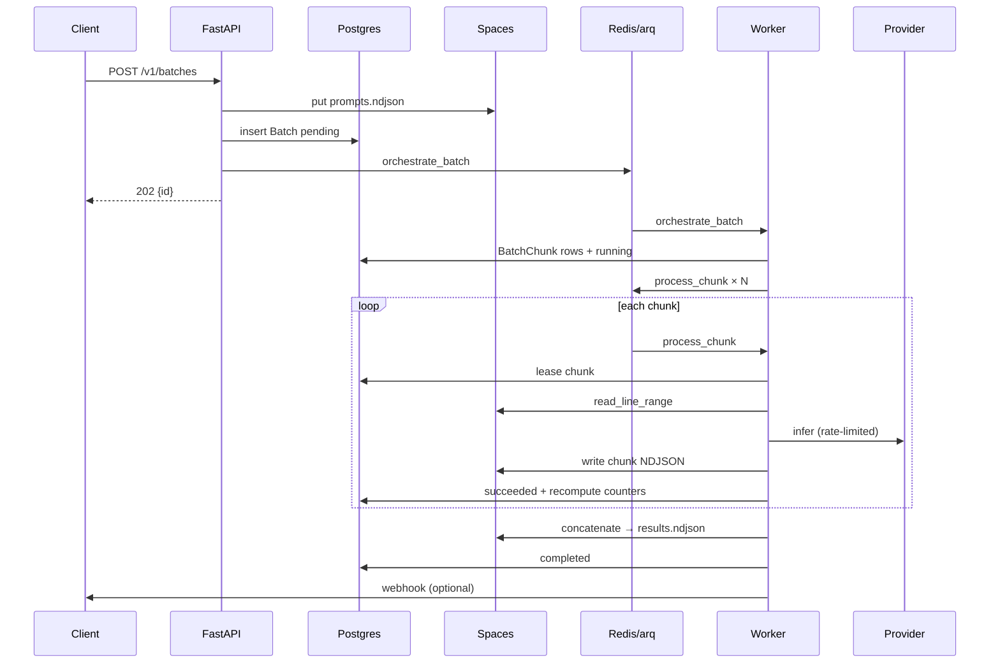

# Batch Inference Service — IC4 System Design

Interview-ready design writeup for this codebase. Companion docs: [architecture.md](./architecture.md) (flow + module map), [scaling.md](./scaling.md) (500k footprint, throttling, bottlenecks).

---

## 1. Problem statement & requirements

### Problem

Clients need to run **large sets of LLM prompts** asynchronously: accept work once, fan out inference across bounded workers, respect provider rate limits, survive worker/API crashes without re-uploading prompts, and notify when results are ready.

Typical sizes: hundreds → **~500k items**. Wall-clock is dominated by provider RPS and latency, not by Postgres/Redis.

### Functional requirements

| ID | Requirement |
|---|---|
| F1 | Create a batch from inline JSON, multipart NDJSON upload, remote URL, or pre-staged Spaces key |
| F2 | Segment into chunks; process chunks concurrently across workers |
| F3 | Per-item inference via pluggable providers (OpenAI, Anthropic, DO Inference, OpenAI-compatible, mock) |
| F4 | Progressive checkpoints: each finished chunk writes NDJSON to object storage before DB success |
| F5 | Aggregate chunk results into a single `results.ndjson` + `manifest.json` |
| F6 | Poll status / progress; download results (stream or presigned redirect) |
| F7 | Optional signed webhooks on `batch.completed` / `batch.failed` |
| F8 | Cancel in-flight batches (best-effort) |
| F9 | Idempotent create via `Idempotency-Key` |
| F10 | Cost-aware default model routing when model omitted |

### Non-functional requirements

| ID | Requirement | Target / note |
|---|---|---|
| N1 | **Throughput** | Sustained rate ≈ `rate_limit_rps` (default 50); horizontal workers soak latency |
| N2 | **Durability** | Prompts + chunk results in Spaces; only job handles in Redis; leases in Postgres |
| N3 | **Fairness** | Per-batch RPS + concurrency knobs; shared Redis token bucket across workers |
| N4 | **Cost** | Prefer cheap catalog models; don’t re-run succeeded chunks; don’t buffer full payloads in Redis |
| N5 | **Crash recovery** | Expired leases reclaim → re-enqueue; progress recomputed from succeeded chunks |
| N6 | **SLO (aspirational)** | Create p99 < 5s for small inline; status always available; webhook delivery retries ≤ 10 with backoff |
| N7 | **Scale** | Design validated for **500k** items @ `chunk_size` 100–500 (see [scaling.md](./scaling.md)) |
| N8 | **Security** | Bearer API keys; HMAC webhook signatures; Spaces can stay private (API streams results) |

### Explicit non-goals (today)

- Streaming token-by-token to clients mid-batch
- Exactly-once provider calls
- Multi-tenant quotas / per-key isolation beyond a shared API-key set
- Interactive chat / conversation state
- Image/audio async invoke paths (DO fal-style)

---

## 2. API surface

Base: FastAPI (`app/api/routes.py`). Auth: `Authorization: Bearer <key>` (`app/api/auth.py`) on batch + webhook-test routes. `/health` and `/metrics` are open.

| Method | Path | Purpose |
|---|---|---|
| `POST` | `/v1/batches` | Create (JSON: `prompts` \| `prompts_url` \| `prompts_key`) → **202** |
| `POST` | `/v1/batches/upload` | Multipart NDJSON/plain-text file → **202** |
| `GET` | `/v1/batches` | List (limit/offset) |
| `GET` | `/v1/batches/{id}` | Status + progress + keys |
| `GET` | `/v1/batches/{id}/results` | Stream NDJSON; `?redirect=true` → 302 presign |
| `POST` | `/v1/batches/{id}/cancel` | Mark cancelled |
| `POST` | `/v1/webhooks/test` | Fire a test webhook |
| `GET` | `/health` | Liveness + build identity |
| `GET` | `/metrics` | Prometheus |

### Create body knobs

- `provider` / `model` / `cost_preference` (`economy` \| `standard` \| `premium`)
- `chunk_size` (1–10_000, default 100)
- `rate_limit_rps` (default 50), `max_concurrency` (default 16)
- `webhook_url` / `webhook_secret` (secret auto-generated if URL set and secret omitted)

### Idempotency

Header `Idempotency-Key` → unique on `batches.idempotency_key`. Same key returns the existing batch (lookup-then-insert; see gaps).

### Webhooks

Events: `batch.completed`, `batch.failed`. Headers: `X-Webhook-Signature: sha256=<hmac>`, `X-Webhook-Event`, `X-Batch-Id`. Payload includes `result_url` (prefers `PUBLIC_BASE_URL` API stream URL), stats, timestamps. Retries with full-jitter backoff up to `WEBHOOK_MAX_ATTEMPTS` (10) → `dead`.

---

## 3. High-level architecture

```mermaid
flowchart LR
  subgraph Ingestion["1. Ingestion"]
    api["POST /v1/batches<br/>JSON · multipart · url · key"]
    create["create_batch<br/>NDJSON → Spaces prompts_key"]
    batch_row["Batch Postgres<br/>status=pending · enqueue"]
    api --> create --> batch_row
  end

  subgraph Segmentation["2. Segmentation"]
    orchestrate["orchestrate_batch<br/>running · plan_chunks"]
    chunks["BatchChunk rows<br/>offset / limit"]
    enqueue["enqueue process_chunk"]
    orchestrate --> chunks --> enqueue
  end

  subgraph Scatter["3. Scatter"]
    workers["arq workers<br/>max_jobs = worker_concurrency"]
    lease["_lease_chunk"]
    infer["asyncio.gather run_one<br/>provider.infer"]
    workers --> lease --> infer
  end

  subgraph Backpressure["4. Throttling"]
    rl["TokenBucketRateLimiter<br/>Redis Lua"]
    gate["BatchConcurrencyGate<br/>per-process semaphore"]
    retry["jittered item/chunk backoff"]
    rl --> retry
    gate --> retry
  end

  subgraph Gather["5. Gather"]
    checkpoint["write_chunk_results"]
    check["check_batch_completion"]
    finalize["finalize_batch<br/>concatenate → results_key"]
    webhook["deliver_batch_webhook"]
    checkpoint --> check --> finalize --> webhook
  end

  batch_row --> orchestrate
  enqueue --> workers
  infer --> rl
  infer --> gate
  retry --> checkpoint
```



**Stores**

| Store | Role |
|---|---|
| **Postgres** | `Batch` / `BatchChunk` lifecycle, leases, counters, webhook state |
| **Redis** | arq job bus + shared token-bucket keys |
| **Spaces/MinIO** | prompts, per-chunk checkpoints, final results, manifest |
| **Providers** | External LLM HTTP APIs |

**Job lifecycle:** `orchestrate_batch` → `process_chunk` × N → `check_batch_completion` → `finalize_batch` → `deliver_batch_webhook` · cron `reclaim_leases_cron` (every second).

Compose local stack: API, worker, Postgres 16, Redis 7, MinIO (`docker-compose.yml`).

---

## 4. Data model

### Postgres — `Batch`

| Field | Notes |
|---|---|
| `id` | ULID (26-char string) |
| `status` | `pending` → `running` → `completed` \| `failed` \| `cancelled` |
| `provider`, `model` | Resolved at create |
| `total_items`, `chunk_size` | Planning inputs |
| `completed_items`, `failed_items` | Recomputed from **succeeded** chunks (`ok_count+fail_count`, `fail_count`) |
| `retry_count` | `sum(max(0, attempts-1))` across chunks |
| `prompts_key`, `results_key`, `manifest_key`, `result_prefix` | Spaces keys |
| `rate_limit_rps`, `max_concurrency` | Per-batch throttles |
| `webhook_*` | URL, secret, status (`none`/`pending`/`delivered`/`dead`), attempts |
| `idempotency_key` | Unique, nullable |

### Postgres — `BatchChunk`

| Field | Notes |
|---|---|
| `(batch_id, chunk_index)` | Unique |
| `offset`, `limit` | Line range into prompts NDJSON |
| `status` | `pending` → `leased` → `succeeded` \| `failed` |
| `leased_until`, `attempts` | Soft lease + retry budget (`CHUNK_MAX_ATTEMPTS`, default 5) |
| `result_key`, `ok_count`, `fail_count`, `error` | Checkpoint metadata |

### Spaces key layout

```
batches/{batch_id}/prompts.ndjson
batches/{batch_id}/chunks/{chunk_index:06d}.ndjson
batches/{batch_id}/results.ndjson
batches/{batch_id}/manifest.json
```

Prompt line shape: `{"index": i, "prompt": "...", ...optional fields}`.

### Redis keys (logical)

| Key | Purpose |
|---|---|
| arq job queues / deferred jobs | `orchestrate_batch`, `process_chunk`, … |
| `rl:{provider}:{model}:{key_hash}` | Token-bucket hash: `tokens`, `ts`, `pause_until` (TTL 3600s) |

Job payloads are tiny: `(batch_id, chunk_id, chunk_index)` — **never** the prompt body.

---

## 5. Core flows

### 5.1 Ingest

1. Auth + validate create request (at least one of prompts / url / key; inline ≤ 50k).
2. `resolve_model` (explicit model wins; else cost tier catalog).
3. Write/copy prompts to `prompts_key`; count lines → `total_items`.
4. Insert `Batch` (`pending`); commit.
5. `arq.enqueue_job("orchestrate_batch", batch.id)` → **202** with id.

**Best path for large N:** client uploads to Spaces first, pass `prompts_key` (server `copy_key` + stream count). Avoid buffering 150MB+ twice on the API.

### 5.2 Orchestrate / segment

1. Set `running`, `started_at`.
2. `create_chunk_rows` → `plan_chunks(total, chunk_size)` → N `BatchChunk` rows (idempotent if re-run).
3. Enqueue `process_chunk` for every non-`succeeded` chunk.
4. Schedule `check_batch_completion` (`_defer_by=2`).

### 5.3 Scatter (process_chunk)

1. Skip if batch terminal.
2. `_lease_chunk`: if free / expired → `leased`, bump `attempts`, set `leased_until`.
3. `read_line_range(prompts_key, offset, limit)`.
4. `asyncio.gather(*[run_one(item)])` under `BatchConcurrencyGate` + Redis token bucket.
5. Per item: up to 3 attempts; retryable vs terminal; honor `Retry-After` via `limiter.pause`.
6. On success: `write_chunk_results` → mark chunk `succeeded` → `_recompute_batch_counters` → nudge completion check.
7. On exception: release lease; re-enqueue with defer until attempts exhausted → batch `failed` + webhook.

### 5.4 Gather / webhook

1. `check_batch_completion`: reclaim leases; if all succeeded → `finalize_batch`; if failed terminal → webhook; else re-enqueue pending + defer self.
2. `finalize_batch`: `concatenate_chunks` → `results_key`; write `manifest_key`; `completed`; enqueue webhook.
3. Client polls or receives webhook; downloads via streaming GET.



---

## 6. Backpressure & rate limiting

Three independent controls (see [scaling.md](./scaling.md) §2):

| Control | Scope | Default | Mechanism |
|---|---|---|---|
| `rate_limit_rps` | **Global** (all workers) | 50 | Redis Lua token bucket; `capacity = rate`; `pause_until` on provider 429 |
| `max_concurrency` | **Per worker process** | 16 | `asyncio.Semaphore` in `BatchConcurrencyGate` |
| `WORKER_CONCURRENCY` | Per process | 32 | arq `max_jobs` (in-flight chunk jobs) |
| Chunk lease | Per chunk | 300s | Postgres `leased_until`; cron reclaim |
| Item retries | Per item | 3 | Full-jitter backoff (cap 8s) |
| Chunk retries | Per chunk | 5 | Re-enqueue `_defer_by=2` |

**Mental model:** sustained throughput ≈ `min(rate_limit_rps, W × max_concurrency / latency)`. Extra workers help latency-bound batches; they do **not** raise RPS past the shared bucket. Gate is intentionally local — scaling workers multiplies concurrency unless you lower `max_concurrency` or make the gate Redis-backed.

`acquire(..., max_wait=120)`: starvation beyond 120s raises `TimeoutError` → chunk failure path.

---

## 7. Failure model & isolation

### Isolation levels

| Layer | Failure behavior |
|---|---|
| **Item** | Provider returns `ok: false` (retryable exhausted or terminal) → recorded in chunk NDJSON; **does not** fail the chunk or batch |
| **Chunk** | Unexpected exception / rate-limit timeout / Spaces I/O → chunk retries; after max attempts → **batch failed** |
| **Batch** | Terminal `failed` / `cancelled` / `completed`; one exhausted chunk fails the whole batch |

**Important semantic:** batch `completed` means “pipeline finished and results aggregated,” **not** “all inferences succeeded.” A batch can complete with `failed_items == total_items`.

### Progress correctness

`_recompute_batch_counters` sums only **succeeded** chunks — idempotent under lease-expiry double-success races (regression covered in `tests/test_batch_counters.py`). Live `retry_count` bumps on re-lease; recompute is source of truth.

### Per-item vs chunk gather

`asyncio.gather(*[run_one(...)])` is called **without** `return_exceptions=True`. Provider-shaped failures are caught inside `run_one`; any unexpected raise (bad JSON line, missing provider `KeyError`, rate-limit timeout) fails the **entire chunk**, discarding sibling successes that weren’t checkpointed yet. That is the main isolation gap.

### Cancel

- API sets `cancelled` + `completed_at` (idempotent if already terminal).
- Workers skip new work if batch terminal; each `run_one` re-reads status — if any cancelled mid-gather, chunk returns to `pending` without writing results.
- Gaps: in-flight provider calls still finish; late cancel after all checks can still mark a chunk `succeeded`; **no `batch.cancelled` webhook**.

---

## 8. Durability & crash recovery

**Design principle:** durable state lives in Spaces + Postgres; Redis is a **volatile job bus**.

| Event | Recovery |
|---|---|
| Worker crash mid-chunk | Lease expires → reclaim to `pending` → `check_batch_completion` / cron re-enqueues |
| Succeeded chunk | Spaces object + DB `succeeded` → never recomputed |
| Redis restart | In-flight/deferred jobs lost; pending leases + completion poll recover work; token buckets reset (brief burst); deferred webhook retries may be lost |
| API crash after commit, before enqueue | Batch stuck `pending` until manual re-orchestrate (gap) |
| Finalize crash after Spaces write, before DB | Re-run finalize (idempotent if already `completed`; else re-concat) |
| Provider outage | Items mark `ok: false` or chunks retry; sustained errors → batch failed |

Checkpoint order: **write Spaces first, then mark DB succeeded** — crash between them wastes work but does not corrupt counters (re-run overwrites same `result_key`).

---

## 9. Scaling to 1k → 500k

Align with [scaling.md](./scaling.md).

### 1k (happy path)

- Default `chunk_size=100` → ~10 chunks; trivial for Redis/Postgres.
- Wall clock ≈ `N / rate_limit_rps` (20s at 50 RPS ignoring latency).
- Inline JSON or upload is fine.

### 500k

| Metric @ `chunk_size=100` | Value |
|---|---|
| Chunk jobs / rows | **5,000** |
| Redis queue payload | ~1 MB order-of-magnitude |
| Steady time @ 50 RPS | **~2.8 h** |
| Objects in Spaces | ~5,002 |

**What works today**

- Small job payloads; Postgres metadata scale
- Progressive chunk checkpoints
- Shared RPS across workers
- Streaming result download through API

**What must change / be careful**

1. **`concatenate_chunks` RAM** — loads entire results body; size finalize worker to **≥ 2–3×** expected results (or stream-merge / multipart compose).
2. **`read_line_range` scan** — always streams from line 0; cost ~O(chunks × file). Prefer `chunk_size` **200–500**.
3. **Ingest** — use `prompts_key`; avoid API double-buffer of ~150MB prompts.
4. **Lease vs duration** — raise `CHUNK_LEASE_SECONDS` if chunk wall time ≫ 5 min.
5. Avoid `chunk_size=1` (500k jobs) and huge chunks with huge outputs (gather + write memory).

Horizontal scale: more workers until RPS saturates; raise `rate_limit_rps` only if the provider allows; more API replicas help ingest only.

---

## 10. Where the system breaks (honest production risks)

IC4 signal: name the cliffs, not just the happy path.

| Risk | Severity | Why |
|---|---|---|
| Finalize OOM | **Critical @ large outputs** | Full results in worker RAM |
| `read_line_range` CPU/IO | **High @ small chunks × large N** | Quadratic-ish scan waste |
| Lease 300s < `job_timeout` 600s | **High** | Duplicate workers; wasted spend; queue amplification |
| `gather` without `return_exceptions` | **Medium–High** | One bad item fails whole chunk |
| Double webhooks | **Medium** | No skip when `webhook_status == delivered` |
| Cancel best-effort | **Medium** | No cancel webhook; race to succeeded chunk |
| Completion stampede | **Medium under load** | Re-enqueues all pending every poll |
| Gate not global | **Medium multi-worker** | Concurrency = W × max_concurrency |
| Idempotency race | **Low–Medium** | Concurrent same key → unique violation / orphan Spaces |
| Unknown provider at create | **Low–Medium** | Fails at first chunk (`KeyError`) not at API |
| Redis loss of deferred webhooks | **Medium ops** | May never retry until re-trigger |
| `/metrics` public | **Low** | Info disclosure if exposed |
| Soft lease (no `FOR UPDATE`) | **Low–Medium** | Dual lease under contention |

**Progress bug history (interview story):** naive counters double-counted under lease races (`completed_items > total`). Fix: recompute from succeeded chunks only — own the failure mode and the invariant.

---

## 11. Interview Q&A (model answers)

### Q1. Walk me through the architecture in 2 minutes.

**A:** Clients POST a batch; API persists prompts to object storage and a Postgres row, then enqueues an arq job. An orchestrator plans fixed-size chunks and fans out `process_chunk` jobs. Workers lease a chunk, read a line range from Spaces, call the LLM under a Redis token bucket and a local concurrency semaphore, checkpoint NDJSON per chunk, and recompute progress. When all chunks succeed we concatenate into `results.ndjson`, write a manifest, and fire a signed webhook. Redis only carries tiny job handles; durability is Spaces + Postgres.

### Q2. Why chunk at all? Why not one job per item or one giant job?

**A:** One job per item at 500k blows the job bus and lease/metadata overhead. One giant job loses crash granularity and can’t parallelize across workers. Chunks (default 100) amortize orchestration, bound reclaim waste, and give progressive checkpoints. Tunable: smaller → more parallelism overhead; larger → longer leases and bigger gather memory.

### Q3. Why arq/Redis instead of SQS / Kafka / Celery?

**A:**
- **SQS:** Excellent at-least-once + visibility timeouts (closer to our leases). We’d still need Postgres for batch aggregation. Extra AWS coupling; local MinIO/Redis compose is simpler for this stack.
- **Kafka:** Great for multi-consumer streams and replay; overkill for “enqueue chunk IDs, process, done.” Operational cost high for a single batch pipeline.
- **Celery:** Similar role; arq is asyncio-native and fits FastAPI workers without a sync bridge.
- **Tradeoff we accepted:** Redis volatility — recover via Postgres leases + completion poll, not via durable queue.

### Q4. Exactly-once vs at-least-once?

**A:** We are **at-least-once** for chunk processing. Leases + reclaim imply duplicate work is possible. We make the success path **idempotent for progress** (overwrite same `result_key`, recompute counters). We do **not** guarantee exactly-once provider calls — that would need request-level idempotency keys with the provider (rarely supported) or a durable “item done” store before calling. Interviewers want you to say: *prefer idempotent effects over pretending exactly-once.*

### Q5. Why not stream tokens to the client?

**A:** Batch product is throughput + durability, not interactive UX. Streaming N× concurrent SSE connections doesn’t survive crashes, complicates aggregation, and fights rate limits. Checkpoint NDJSON per chunk + final object + webhook matches “submit and collect.” Per-item streaming belongs in an online inference API.

### Q6. How do you rate-limit across many workers?

**A:** Redis Lua token bucket keyed by provider/model/API-key hash — atomic refill/acquire shared by all processes. Local semaphore only caps concurrent in-flight HTTP per process. Sustained RPS is the bucket; concurrency is for latency hiding.

### Q7. How do you handle provider 429s?

**A:** Classify 429/5xx as retryable; read `Retry-After`; `limiter.pause(bucket, seconds)` so *all* workers stop drawing tokens; item-level jittered backoff up to 3 attempts; then record item failure without failing the batch.

### Q8. What happens if a worker dies mid-chunk?

**A:** Lease expires (`CHUNK_LEASE_SECONDS`); cron/`check_batch_completion` sets chunk `pending` and re-enqueues. Partial in-memory outcomes are discarded; no half-written “success” without Spaces object + DB update. Attempts increment — burn budget under flapping deploys.

### Q9. Lease 300s vs job_timeout 600s — problem?

**A:** Yes. A slow chunk can still be running when the lease expires; another worker may start the same chunk. Wastes money and can amplify load. Fix options: lease ≥ expected chunk duration; heartbeat/extend lease; align `job_timeout` with lease; or stop on lease loss. Call this out proactively.

### Q10. How does progress stay correct under retries?

**A:** Don’t increment counters naively. On success, recompute `completed_items` / `failed_items` from all succeeded chunks’ `ok_count`/`fail_count`. Double-runs can’t double-count. `retry_count` = sum of excess attempts.

### Q11. Multi-tenant fairness?

**A:** Today: weak. Shared API-key set; per-batch RPS; global buckets per provider key. Missing: per-tenant quotas, weighted fair queuing, separate buckets per API key, admission control when backlog is huge. I’d add `tenant_id` on Batch, Redis buckets `rl:{tenant}:{provider}:…`, and a global admission semaphore on orchestrate.

### Q12. Cost routing — how and why?

**A:** `resolve_model` uses a static catalog rank; `cost_preference` caps max rank; explicit model always wins. Why: default to cheap models for batch workloads where quality bar is often “good enough,” and make spend an explicit product knob.

### Q13. How would you observe this in production?

**A:** Prometheus: inference latency/requests, rate-limit waits, chunks inflight, webhook outcomes, batch terminal counts. Structured logs with `batch_id` / `chunk_index`. Alerts: batch failed rate, webhook dead, chunks inflight stuck, finalize duration/OOM kills, token-bucket wait spikes. Trace one batch_id end-to-end in logs.

### Q14. Security model?

**A:** Bearer API keys (shared secret list — rotate via `API_KEYS`). Webhook HMAC-SHA256 over raw body. Spaces credentials server-side; prefer private bucket + authenticated API stream over public presign. Gaps: no per-tenant keys, no mTLS, `/metrics` open, webhook SSRF risk if URL not allowlisted.

### Q15. How do webhooks avoid duplicates?

**A:** They don’t fully today — receivers must be idempotent on `(batch_id, event)`. I’d gate delivery on CAS `webhook_status` pending→delivered, or store `delivery_id` / event nonce. At-least-once delivery is the honest contract.

### Q16. Why Postgres + Spaces instead of storing results in Postgres?

**A:** 500k NDJSON lines × KB outputs is GB-scale; Postgres is the wrong blob store. Metadata and leases fit relational queries; payloads fit object storage. Also enables presigned download and progressive chunk objects without rewriting huge rows.

### Q17. What’s the bottleneck at 500k?

**A:** Usually provider RPS (wall clock ≈ N/R). Next: finalize memory and `read_line_range` scan cost. Postgres/Redis are not the bottleneck at 5k chunks.

### Q18. How would you change finalize for multi-GB results?

**A:** Stream-concatenate (multipart upload / compose API / write as you read), or leave results as a manifest of chunk keys and teach the download API to concatenate on the fly (or return a zip). Never `parts.append(full_body)` for unbounded N.

### Q19. Cancel semantics — strong or weak?

**A:** Weak/best-effort. We flip Postgres status; workers eventually stop scheduling new provider calls. In-flight calls complete; no cancel webhook; race can still succeed a chunk. Strong cancel needs cooperative cancellation tokens into HTTP clients and a terminal barrier before checkpoint.

### Q20. What breaks first in a noisy neighbor scenario (many batches)?

**A:** Shared provider token bucket + worker slots. One huge batch can dominate. Fix: per-tenant buckets, separate queues/priorities, max in-flight chunks per batch, admission control on orchestrate.

### Q21. Alternatives to DigitalOcean Spaces?

**A:** Any S3-compatible store (AWS S3, GCS XML API, R2). Interface is already `SpacesClient` via aioboto3. Semantics unchanged.

### Q22. Why ULID for batch ids?

**A:** Sortable time component, opaque, fits string PK, nicer for log correlation than random UUID v4. Not load-bearing for correctness.

### Q23. How do you test this?

**A:** Unit: counters/leases (`test_batch_counters`), idempotency, planning. E2E with mock provider + fake/MinIO Spaces. Chaos: kill worker mid-lease, assert reclaim. Load: measure RPS adherence and finalize memory. Interview: mention the progress double-count bug as a test-driven invariant.

### Q24. If you had one week to harden for production, what first?

**A:** (1) Stream finalize / OOM-proof concat, (2) lease heartbeat + align timeouts, (3) `return_exceptions` + per-item isolation, (4) webhook idempotent delivery guard, (5) validate provider at create + tenant rate buckets. Order by blast radius × likelihood.

### Q25. CAP / consistency story?

**A:** Not a multi-region DB story. Single-region strong consistency for metadata (Postgres). Object store is eventually consistent in theory (S3-style) but we write-then-read our own keys in one region — treat as read-after-write for our workload. Queue is best-effort; truth is Postgres status + Spaces artifacts.

---

## 12. Alternatives considered

| Alternative | Pros | Cons | Why not (for this system) |
|---|---|---|---|
| **AWS SQS + Lambda** | Managed scale, visibility timeout ≈ lease | Cold starts, dual-cloud, harder local parity | DO-centric stack; long LLM calls fit workers better |
| **Kafka / Redpanda** | Replay, fan-out, backpressure | Ops heavy; chunk IDs don’t need a log | Overkill |
| **Step Functions / DO Functions workflows** | Visual orchestration, retries | Cost/latency per state transition at 5k chunks; awkward for tight rate limits | Chunk fan-out + shared bucket fits workers |
| **Celery + RabbitMQ** | Mature ecosystem | Sync bias; more moving parts | arq + Redis already present |
| **Ray / Flyte / batch K8s jobs** | Heavy ML orchestration | Complex for HTTP LLM batching | Wrong abstraction layer |
| **Store all state in Redis** | Fast | Crash / memory / no rich query | Violates durability goal |
| **No chunks (single process map)** | Simple | No horizontal scale / crash isolation | Fails 500k brief |
| **Client-side fan-out** | No server | No shared rate limit, no durability product | Not a service |

---

## 13. Observability, security, multi-tenancy gaps

### Observability (have)

- Prometheus counters/histograms/gauges (`app/core/metrics.py`)
- Structured logging with batch/chunk fields
- `/health` build identity (`git_sha`, `build_id`)

### Observability (gaps)

- No distributed tracing (OpenTelemetry) across API → arq → provider
- No per-batch cost/token accounting dashboard
- No SLO burn alerts defined in-repo
- Finalize duration / Spaces bytes not first-class metrics

### Security (have)

- Bearer API keys; webhook HMAC; private MinIO + API stream path

### Security (gaps)

- Shared key pool (no tenant ACL on `GET /batches/{id}` — any key can read any batch)
- Webhook URL SSRF (no allowlist / block private ranges)
- `/metrics` unauthenticated
- Secrets in env only (fine); no KMS-envelope for `webhook_secret` at rest beyond DB

### Multi-tenancy (gaps)

- No `tenant_id` / ownership column
- No per-tenant quota, fair share, or billing meters
- List endpoint is global
- Concurrency gate and job queue are shared

---

## 14. What I’d build next (IC4-prioritized roadmap)

Ordered by **user-visible correctness × scale risk**:

| Priority | Item | Rationale |
|---|---|---|
| P0 | Stream / multipart finalize | Removes 500k OOM cliff |
| P0 | Lease heartbeat + align `job_timeout` | Stops duplicate spend |
| P0 | `gather(..., return_exceptions=True)` + isolate item errors | True per-item isolation |
| P1 | Webhook delivery CAS / idempotency key | Exactly-once *effect* for clients |
| P1 | Indexed / ranged prompt reads (byte offsets or chunked prompt objects) | Kill scan amplification |
| P1 | Validate provider+model at create time | Fail fast |
| P2 | Tenant ownership + per-key rate buckets | Fair multi-tenant |
| P2 | Cancel webhook + stronger cancel barrier | Product completeness |
| P2 | Re-orchestrate stuck `pending` / lost enqueue | API crash gap |
| P3 | OpenTelemetry traces | Debug multi-hop latency |
| P3 | Partial batch success policy (don’t fail all on one chunk) | Configurable product semantics |
| P3 | Global concurrency gate in Redis | Match mental model of `max_concurrency` |

---

## Appendix A — Default knobs cheatsheet

| Setting | Default |
|---|---|
| `DEFAULT_CHUNK_SIZE` | 100 |
| `DEFAULT_RATE_LIMIT_RPS` | 50 |
| `DEFAULT_MAX_CONCURRENCY` | 16 |
| `WORKER_CONCURRENCY` | 32 |
| `CHUNK_LEASE_SECONDS` | 300 |
| `CHUNK_MAX_ATTEMPTS` | 5 |
| `job_timeout` | 600 s |
| Per-item retries | 3 |
| `WEBHOOK_MAX_ATTEMPTS` | 10 |

## Appendix B — Code map

| Concern | Module |
|---|---|
| API | `app/api/routes.py`, `schemas.py`, `auth.py` |
| Create / cancel / plan | `app/services/batches.py`, `routing.py` |
| Workers | `app/workers/jobs.py`, `main.py` |
| Rate limit | `app/rate_limit/__init__.py` |
| Spaces | `app/core/spaces.py` |
| Providers | `app/providers/` |
| Webhooks | `app/services/webhooks.py` |
| Models | `app/models/__init__.py` |
| Compose | `docker-compose.yml` |

## Appendix C — Talking points for the interview whiteboard

1. Draw ingest → Spaces → Postgres → Redis → workers → checkpoint → finalize → webhook.
2. Emphasize **small queue messages, large objects in blob store**.
3. Draw the **token bucket (global)** vs **semaphore (local)** distinction.
4. State the **at-least-once + idempotent progress** contract.
5. Voluntarily list cliffs: finalize RAM, lease/timeout skew, gather isolation, double webhooks.
6. Show the 500k math: \(T \approx N / R\) + finalize; 5k chunks @ size 100.
7. End with roadmap prioritized by blast radius — that’s IC4 judgment.
